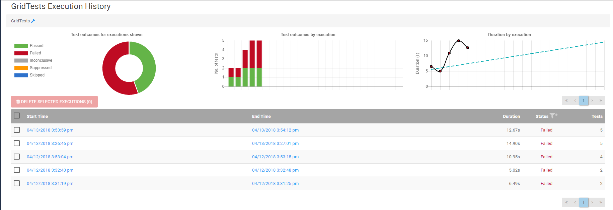
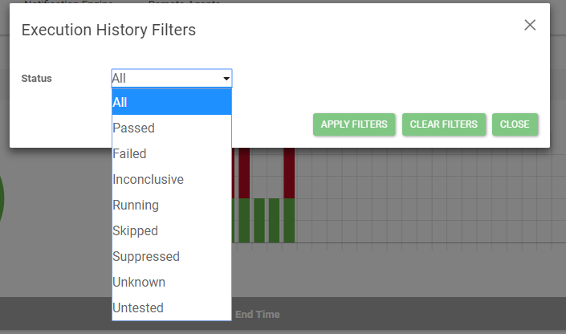
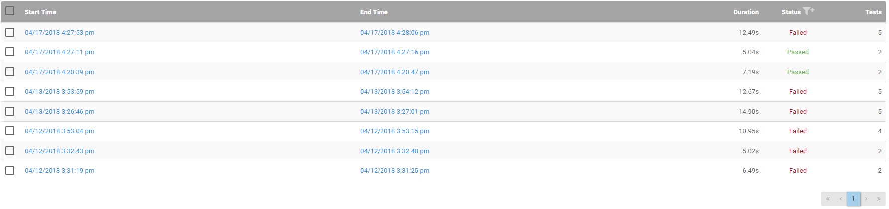
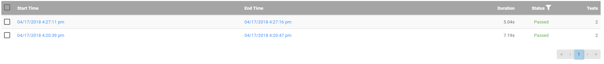

# Execution History

## Overview

The Execution History page will list all instances this test object has run. The table lists start time, end time, duration, status, and number of tests contained within the selected test object. The runs
are ordered by most recently run. The table can be filtered on status to show only items of a single status. From this view users can also delete any run they wish, doing so however, will prevent the details of 
that run from being viewed on LegiTest Online. Deleting a run does not affect the actual test object found on the summary page, and the test object will still be displayed. Clicking through a history item will bring
the user to the [Execution Details](executionDetails.md) page for that test object. The charts at the top of the page give users a quick glimpse at how this test object has been performing over time. 

## Filter On Status
To being filtering on status, first click the filter icon next to the Status header in the execution history table. This will bring up the filter dialog.

Once up, select the desired status to filter on then click apply filters. In the following photos, see the before and after when filtering on Passed status.

Once filters are applied the "Edit Filters" and "Clear Filters" buttons will appear above the table, allowing users to quickly select a new status to filter on, or remove filtering completely.
