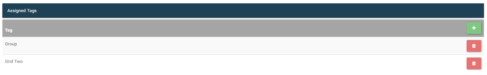
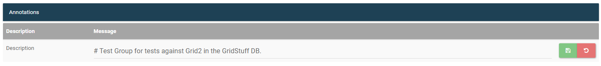
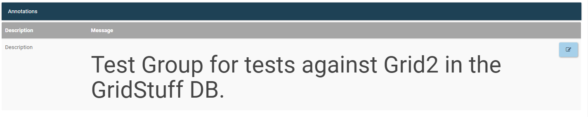
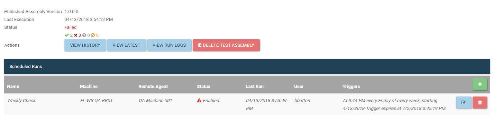
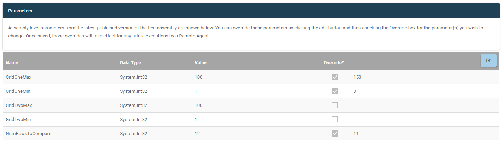
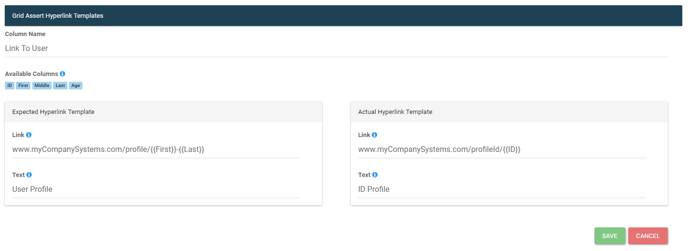

# Test Object Management
The test object management page is a one stop page for managing multiple aspects of tests and assemblies.
Parameters, tags, and scheduled tasks can all be managed from this page. Available management options will change
depending on what level test object is being viewed. 

## Tags
From the management page users can add or remove tags from the current test object.

## Annotations
Annotations can be viewed and edited from the managment page for test objects that support annotations.
Annotations can contain markdown and will be displayed with the markdown formatting when being viewed. Once a 
user clicks to edit, they will see the markdown syntax that can also be edited and saved.

## Assembly Management
At the assembly level management page, if any test assemblies have been pushed to LegiTest Online, there will be an option
to delete these assemblies from LTO. This does not delete the published test results, but only the assemblies used to 
run the test from LTO. From the assembly management page, test runs can also be scheduled or existing schedules can be edited. To
learn more on scheduling test runs visit the [Scheduling Test Runs](scheduleRuns.md) help page.

### Parameters
If assemblies have been pushed to LTO, and if any parameters were used in the test, then
those parameters will be listed here. Users will have the option to override these parameters
for future test runs that are initiated from LTO.

## Hyperlink for Grid Asserts
Grid assertions such as a grid comparison or grid validation allow users to specify hyperlinks for the grid results that are displayed
in the assertion details page on LTO. These hyperlinks are edited and created on the management page at the assertion level. A list
of columns available for reference will be listed, and these column can be refference using the following syntax {{columnName}}.
This provides users a simple way to link to items in their data sets. For example, a row that contains ID, First, Last and has a hyperlink
template set up as https://www.google.com/search?q={{First}}, with row values 1, Samantha, Carter, would produce a hyperlink that looked like this:
https://www.google.com/search?q=Samantha.

