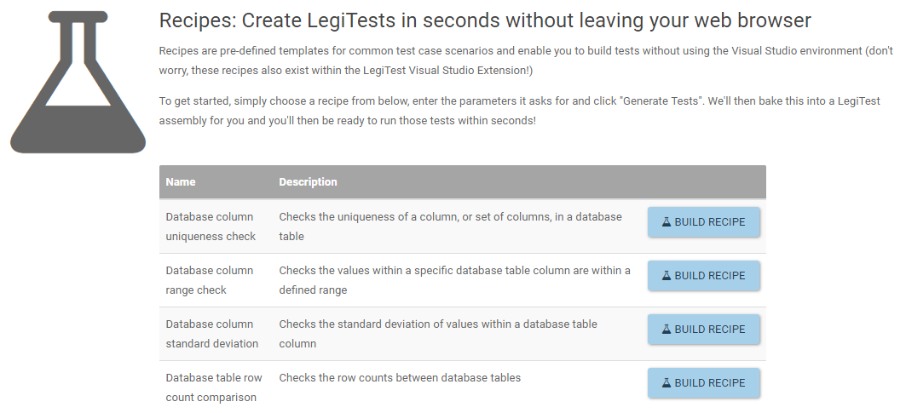

# Recipes
Recipes on LegiTest Online allow for quick generation of an assembly containing the test generated by the recipe selected. Once created on LTO, the recipe will generate an assembly
that is dumped into the unexecuted assemblies section of the dashboard. Once present in the unexecuted assemblies, the newly generated test can be run using an installed remote agent. 

