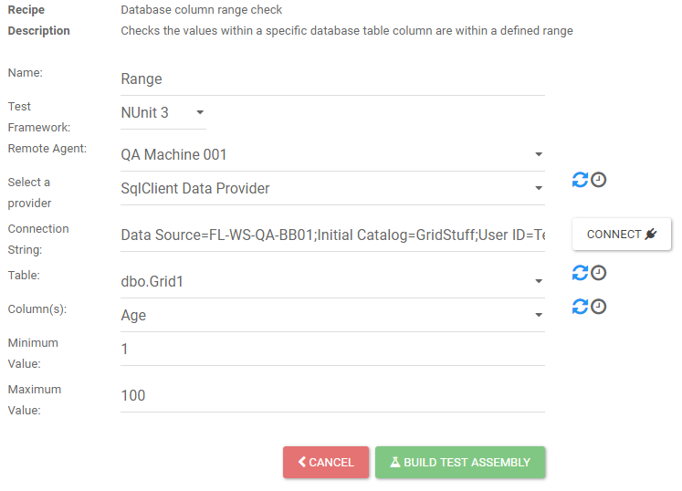

# Database Table Row Count Comparison

The Database Table Row Count Comparison checks the row counts between database tables.

* __Name__ - Name to give the assembly that will contain the test generated from the recipe.
* __Test Framework__ - The test framework the test will be created with. Can select from NUnit 2, NUnit 3, or MSTest.
* __Create a data-driven test with a case for each table__ - Checking this option will create a single test, that is data-driven instead of a single test per table comparison.
* __Remote Agent__ - Selecting a remote agent is optional. If a remote agent is selected, then the connection string supplied will apply to the machine running the remote agent.
* __Source Database Provider__ - The provider for the source connection string.
* __Source Connection String__ - Connection string to the source data source.
* __Use Source Provider and Connection for Target__ - Checking this will copy the previous source database provider and source connection string into the target. Useful if all tables to be compared are at the same connection.
* __Source Tables__ - List of all tables available to use as source for the comparison.
* __Target Tables__ - List of all tables available to use as target for the comparison.
* __Add__ - Adds the two selected tables to the list of tables to be compared. 
* __Comparison table__ - The table at the bottom holds all the comparisons added to be part of the test. Each tabled as a filter line under it that allows for simple filtering to further narrow the comparisons. Comparison can be as simple as Age < 100. Comparison can also be removed if they were added in error. 