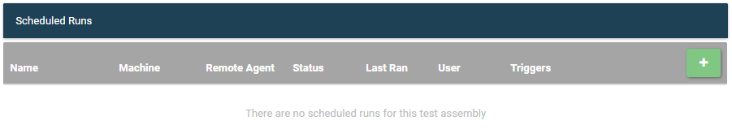
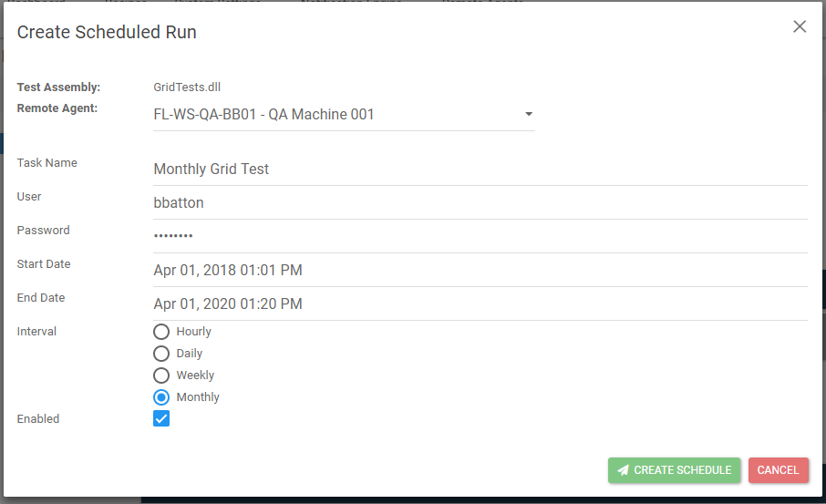
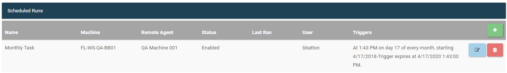

# Schedule Test Runs

To schedule a test run, the assemblies for the desired test assembly need to be published to LegiTest Online. There must also be a Remote Agent set up to handle the running and scheduling of tests. 
Once those items are set up, a test run can be scheduled from the Assembly Management page. In the above image, there are currently no runs scheduled. To begin scheduling, click the green plus button in the top right corner.
This will open the scheduling dialog.

* __Test Assembly__ - The name of the assembly being schedule. Auto populated and cannot be changed.
* __Remote Agent__ - Here the user will choose which Remote Agent is to be used when running the assembly on its schedule.
* __Task Name__ - A name for the task, this will show up in LegiTest Online on the management page, as well as in the Window's Task Scheduler.
* __User__ - This is the user that the assembly will be run under on the machine that remote agent is on. Be sure this user has permissions to access all aspects of the test.
* __Password__ - The password for the user entered above.
* __Start Date__ -  The first date and time the assembly will be run. This date will be used as reference for the interval.
* __End Date__ - When the scheduled task should expire and stop running. 
* __Interval__ - The interval the assembly should be run. The start date will be the reference point for the start of the interval.
* __Enabled__ - This will set whether the scheduled run should be enabled or disabled. Tasks can be edited from the management page to enable or disable them from running.

Once all fields are populated, click Create Schedule. The management page will be shown again with the new task scheduled.

Once created, the tasks can be edited or deleted from LTO. Deleting will permanently remove it from LTO and prevent future runs. Editing will allow for all fields to be changed, including the enabled field. This will allow for users to temporarily stop runs without removing the task entirely.
