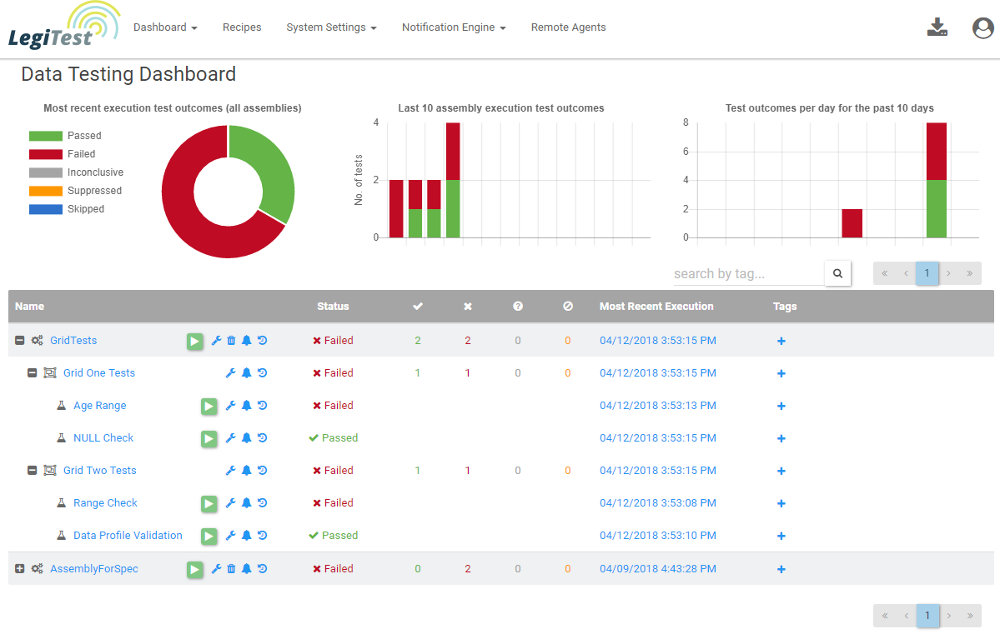

# Dashboard

## Dashboard Introduction
The LegiTest Online dashboard is broken into 3 parts. The Summary Dashboard, [Unexecuted Assemblies](unexecutedAssemblies.md), and [Trash](trash.md).
The Summary Dashboard is the landing page once signed into LTO.

## Summary Dashboard
The Summary Dashboard list all recent executions that have had results set to publish to LegiTest Online. The tests are listed
in order of execution, with the most recently run assembly at the top level. Only the assembly level is listed, but each assembly item can
be drilled down into to see the Test Groups contained, and then each Test Group can be expanded to show the tests it contains.

## Dashboard Icons
In the above picture, on the any given row, you can see several icons to the right of the name. Click through each link to learn more about how these items work.
*  - [Manage](manage.md)
*  - [Trash](trash.md)
*  - [Notifications](notifications.md)
*  - [Execution History](executionHistory.md)

## Status
The next column on the summary tree table is the status column. This will display the overall status for the level being viewed. This means
that if any test in the assembly has failed, the entire assembly would be marked as failed. 

## Test Count by status
The next 4 columns display from left to right are Passed, Failed, Inconclusive, and [Suppressed](suppression.md). The number under
each will display how many tests contained at that level had the corresponding status.

## Most Recent Execution
This column will list the date and time the test object being view was last run. The most recently run items are at the top of the summary tree table. This column is also clickable, and will 
take you to the execution details page for that test object. 

## Tags
This column allows the user to quickly add tags to the test object. These are all user created, and allows for tests to quickly be filtered to find waht you are looking for.