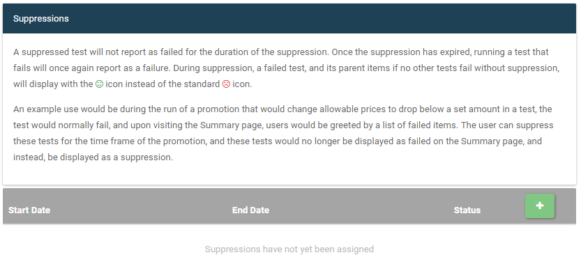
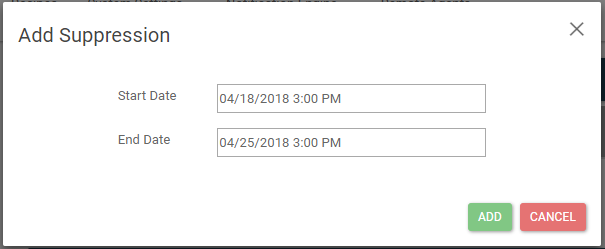
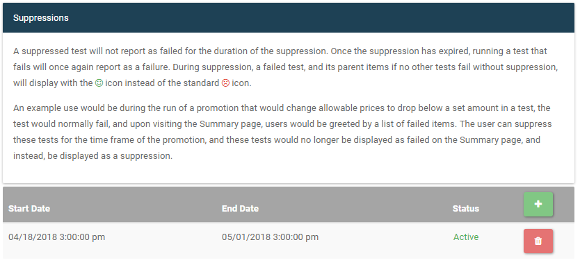
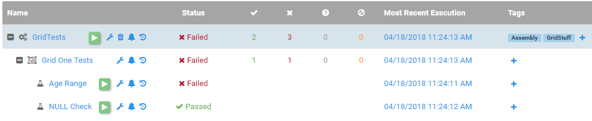
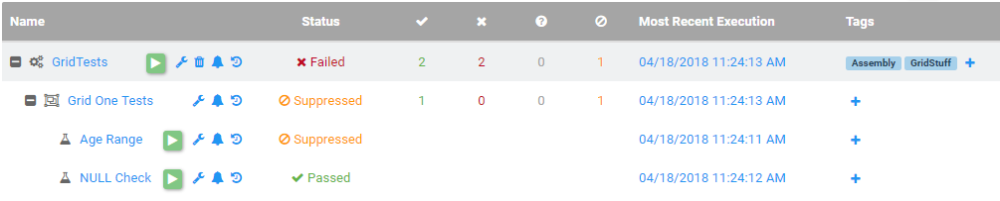

# Suppress Test Results
Suppressing a test prevents the test from reporting as failed for the duration set by the user. All executions of that test in the given timeframe will instead
report as suppressed, and parent items, if no other failures reported, will report as passed. This is useful for when a user knows that a test will fail
for a given time frame, such as a price comparison test during a sale. 

## Suppressing a Test
To get started, first visit the management page for the test you desire to suppress. On this page, at the bottom you will see the suppression table.

To add your first suppression, click the green plus button at the top right of the suppression table. This will bring up the Add Suppression dialog.

Set the desired time frame for the suppression, then click Add. This will add the suppression to the table on the management page.

From the suppression table, users can remove suppressions they no longer wish to have applied to tests in the designated time frame. 

#### Before Suppression

#### After Suppression
