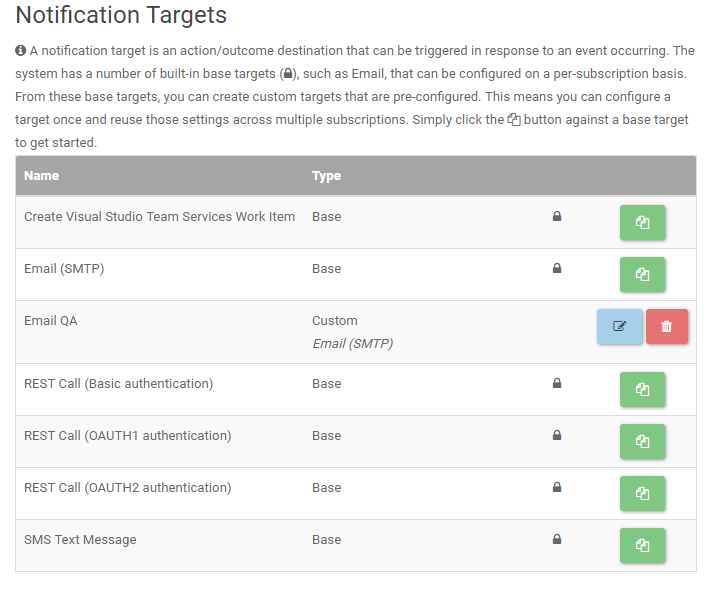

# Notification Targets
The LegiTest Online Notifications allow for users to set up custom re-usable notification targets. Doing so prevents users from having to re-enter the same information for multiple different subscriptions each time they set one up.
These custom targets are built off of one of the base targets located on the Notification Targets page. In the table on that page, items with a lock icon and designated as base are the targets users can select to build off of. Clicking the 
green icon on the row for the desired type of target will create a duplicate and bring the user to page to fill in the information for that target. Once filled out, the user can save it, and it will show up on the target table as a custom
target. This custom targets can then be selected during the Action or Subscription creation process.

## Providers
The notification targets consist of several types of notification providers, each configurable for the user's needs.

#### Create Visual Studio Team Services Work Item

This provider will create a work item on the users VSTS project. The body of the item will include whatever template is ued to set it up.

* __Name__ - Name to be given to the target item, this appears in the notification targets table.
* __Username__ - Username used to log into VSTS. Alternate credentials must be enabled on VSTS for this user.
* __Password__ - Password used to log into VSTS for the above user.
* __Host Name__ - The name of the Visual Studio Team Services host that contains the target project (e.g. myinstance.visualstudio.com).
* __Collection Name__ - The name of the team project collection that contains the target project (e.g. DefaultCollection).
* __Project Name__ - The name of the target project.
* __Work Item Type__ - The type of work item to create (e.g. Bug).

#### Email (SMTP)

This provider will send an email using the provided account information (SMTP) to the listed recepients.

* __Name__ - Name to be given to the target item, this appears in the notification targets table.
* __Host__ - The host address of the SMTP to server to use (e.g. smtp.gmail.com, localhost, or smtp.microsoft.com).
* __Port__ - The port number your SMTP server requires.  The most used port for non-secured email servers is 25 and for secured email servers is 443.
* __Enable SSL__ - Enable or disable depending on the requirements of the SMTP server.
* __Use Default Credentials__ - Check this if the SMTP requires the currently logged in user be authenticated before sending.
* __Timeout in Seconds__ - The time to wait (in seconds) for the email server to send the message(s).  The default is 100 seconds.
* __Service Provider Name__ - The Service Provider Name (SPN) to use for authentication when using extended protection.
* __Username__ - The username to authenticate with the email server.  If a username is specified, the default credentials will not be used.
* __Password__ - The passord to authenticate with the email server.
* __Subject__ - The subject line for the email.
* __Reply To Email Addresses__ - The email addresses to reply to instead of using the From Email Address.
* __Priority__ - The priority of the email being sent.
* __Is Message HTML__ - Determines if the email content should be rendered as HTML or plaintext.
* __CC Email Addresses__ - The carbon copy email addresses to which the email will be sent.
* __BCC Email Addresses__ - The blind carbon copy email addresses to which the email will be sent.  Any other email recipients will not be able to see who the other recipients are.
* __To Email Addresses__ - The email addresses to which the email will be sent.
* __From Email Address__ - The email address that recipients will see as the sender of the email.
* __From Display Name__ - The name to display as the sender of the email.  Many email clients will display this name instead of or in addition to the From Email Address.

#### REST Call (Basic authentication)

This provider will trigger a REST Call using basic authentication.

* __Name__ - Name to be given to the target item, this appears in the notification targets table.
* __Username__ - The user name to use to authenticate with the host.
* __Password__ - The password to use to authenticate with the host.
* __Use base64 authentication header__ - Check if the authentication should be base64 encoded.
* __Endpoint URL__ - The URL to post the notification to.
* __Content type__ - The content type to use to send data to the server.
* __HTTP request method__ - The method to be used when making the call.
* __Headers__ - Any custom headers required - one per line, in the format header=value.
* __Security Protocol__ - Identifies the transport layer security or secure sockets layer used by the endpoint.
* __Proxy host name__ - The host name of the proxy to use, if any.
* __Proxy port__ - The port number of the proxy to use.
* __Proxy username__ - The user name to use to authenticate with the proxy.
* __Proxy password__ - The password to use to authenticate with the proxy.
* __Proxy domain__ - The domain to use to authenticate with the proxy.

#### REST Call (OAUTH1 authentication)

This provider will trigger a REST Call using OAUTH1 authentication.

* __Name__ - Name to be given to the target item, this appears in the notification targets table.
* __Api key__ - Authentication key provided at the application's developer site.
* __Api secret__ - Authentication secret provided at the application's developer site.
* __Token__ - The token required by the web API. This information is provided at the application's developer site.
* __Token secret__ - The token's secret 'password' provided at the application's developer site.
* __Signature type__ - The signature type to use.
* __Endpoint URL__ - The URL to post the notification to.
* __Content type__ - The content type to use to send data to the server.
* __HTTP request method__ - The method to be used when making the call.
* __Headers__ - Any custom headers required - one per line, in the format header=value.
* __Security Protocol__ - Identifies the transport layer security or secure sockets layer used by the endpoint.
* __Proxy host name__ - The host name of the proxy to use, if any.
* __Proxy port__ - The port number of the proxy to use.
* __Proxy username__ - The user name to use to authenticate with the proxy.
* __Proxy password__ - The password to use to authenticate with the proxy.
* __Proxy domain__ - The domain to use to authenticate with the proxy.

#### REST Call (OAUTH2 authentication)

This provider will trigger a REST Call using OAUTH2 authentication.

* __Name__ - Name to be given to the target item, this appears in the notification targets table.
* __Api key__ - Authentication key provided at the application's developer site.
* __Api secret__ - Authentication secret provided at the application's developer site.
* __Access token__ - Carries the necessary information the API uses to determine whether the client is authorized or not. The access token provided at the application's developer site.
* __Is bearer token__ - An authorization header that is required by some APIs. If the API issues a bearer token, this should be true.
* __Refresh Token__ - The token given to the user by the application/service. This call allows users to request new access tokens.
* __Refresh token request URL__ - The URL to which token refresh requests will be sent.
* __Refresh token request parameters__ - The query parameters used during the refresh token request.
* __Refresh token access JSON path__ - When making the request to get a new access token, the service will return that access token in Json. This property is the path to that token.
* __Endpoint URL__ - The URL to post the notification to.
* __Content type__ - The content type to use to send data to the server.
* __HTTP request method__ - The method to be used when making the call.
* __Headers__ - Any custom headers required - one per line, in the format header=value.
* __Security Protocol__ - Identifies the transport layer security or secure sockets layer used by the endpoint.
* __Proxy host name__ - The host name of the proxy to use, if any.
* __Proxy port__ - The port number of the proxy to use.
* __Proxy username__ - The user name to use to authenticate with the proxy.
* __Proxy password__ - The password to use to authenticate with the proxy.
* __Proxy domain__ - The domain to use to authenticate with the proxy.

#### SMS Text Message

This provider will use a user provided SMS host to send text messages.

* __Name__ - Name to be given to the target item, this appears in the notification targets table.
* __Host__ - Host addess for the email service.
* __Port__ - Port number required by the email host.
* __Enable SSL__ - Check to enable SSL if required by the email host.
* __Use Default Credentials__ - Check if the host requires authenticating the user logged on when the message is sent.
* __Timeout in Seconds__ - Time to wait for the email to send.
* __Username__ - Username to authenticate on the email host.
* __Password__ - Password to authenticate on the email host.
* __Subject__ - Subject line for the sent email.
* __Priority__ - Priority level for the message.
* __SMS Provider__ - The provider of SMS or MMS gateway services.  Please contact the intended phone numbers' service provider for more information on possible limitations and requirements.  This field should only contain the domain of the SMS provider gateway, but if a gateway requires a prefix or suffix; use the following format: "999|PhoneNumber|@hello.com".
* __Phone Numbers__ - The phone numbers to which the text message(s) will be sent.  All specified phone numbers must be serviceable by the selected provider.  Separate phone numbers by a semicolon ( ; ) or comma ( , ).
* __From Email Address__ - The email address that recipients will see as the sender of the email.
* __From Display Name__ - The name to display as the sender of the email.  Many email clients will display this name instead of or in addition to the From Email Address.