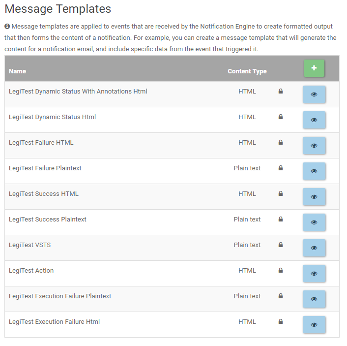

# Notification Templates

The Notification Enginge on LegiTest Online comes with several pre-configured notification templates. These templates were built to provide just the right amount of information to quickly examine failures or successes, or to accompany certain targets or actions.
Users can also create custom templates that add or subtract information, using a prebuilt template as the base, or they can create one completely from scratch.

