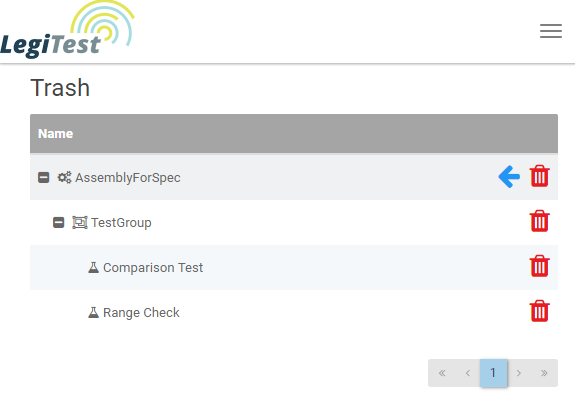

# Trash
Once a test object is sent to the trash from the summary dashboard, it will be located in the trash page.
From here, items can be permanently deleted from LegiTest Online by clicking the red trash can button. Alternatively
you can move these items back to the summary dashboard by clicking the arrow button located at the assembly level. This will move
all items in that assembly back to the summary dashboard.

