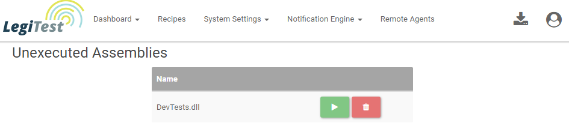

# Unexecuted Assemblies
Assemblies can be pushed to LegiTest Online without having to be executed first. The unexecuted assemblies can be found 
on the unexecuted assemblies page. From here, assemblies can be executed using a remote agent, or deleted from LegiTest Online 
completely. 

