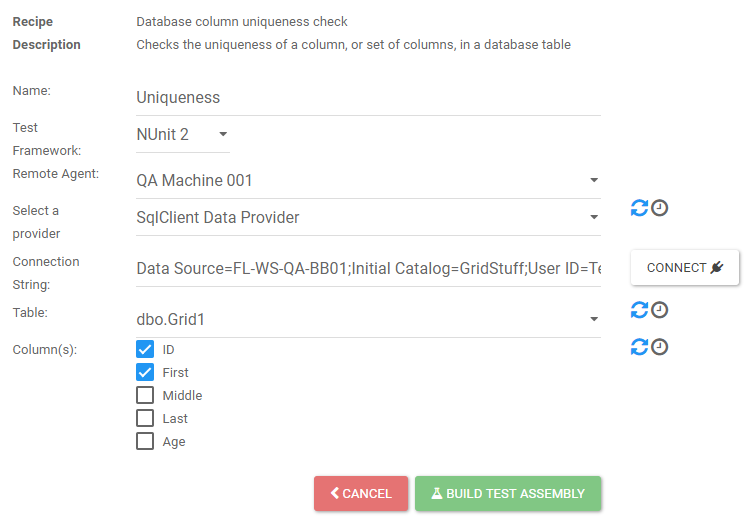

# Database Column Uniqueness Check

The Database Column Uniqueness Check checks the uniqueness of a column, or set of columns, in a database table. 

* __Name__ - Name to give the assembly that will contain the test generated from the recipe.
* __Test Framework__ - The test framework the test will be created with. Can select from NUnit 2, NUnit 3, or MSTest.
* __Remote Agent__ - Selecting a remote agent is optional. If a remote agent is selected, then the connection string supplied will apply to the machine running the remote agent.
* __Select a Provider__ - The provider for the connection string.
* __Connection String__ - Connection string to the data source.
* __Table__ - Once the provider and connection string are set, this drop down will show all available tables found.
* __Columns__ - Once a table is selected, the columns will be populated. Select the column(s) to check for uniqueness against. 